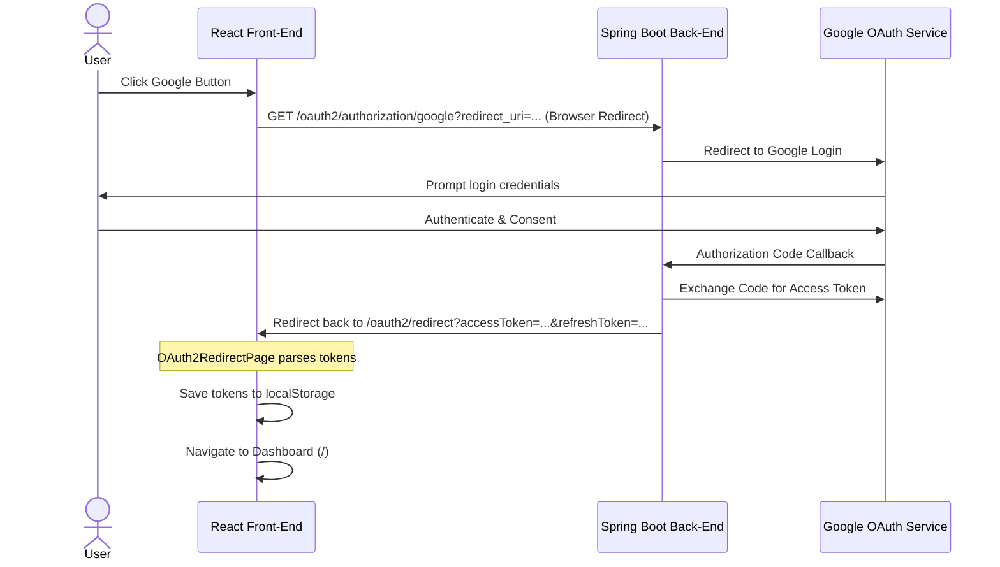

# Google OAuth2 Integration Design

This document details the design for integrating Google OAuth2 login and registration in the Engrow front-end application, communicating with the Spring Boot backend.

## Context & Requirements

1. **OAuth2 Flow Initiator**:
   - The UI already contains Google buttons in both the Login and Registration screens.
   - These buttons must NOT change visually, but clicking them must redirect the browser to the backend OAuth2 authorization URL:
     `http://localhost:8080/oauth2/authorization/google?redirect_uri=http://localhost:5173/oauth2/redirect`
   - To support multiple environments, the backend base URL will be derived dynamically using `import.meta.env.VITE_BASE_URL` (defaulting to `http://localhost:8080`), and the redirect URI will use `window.location.origin`.

2. **Redirect Handler**:
   - The backend will complete the OAuth2 flow and redirect the user back to the front-end callback endpoint: `${window.location.origin}/oauth2/redirect?accessToken=...&refreshToken=...`.
   - The front-end must expose a route `/oauth2/redirect` handled by `OAuth2RedirectPage`.
   - The page will extract `accessToken` and `refreshToken` from the query parameters, store them in `localStorage`, and redirect the user to the Dashboard (`/`).

## Architecture & Flow



## Detailed Components

### 1. OAuth2 Redirect Page (`src/features/auth/pages/OAuth2RedirectPage.tsx`)
- Reads search params using `useSearchParams()`.
- Extracts `accessToken` and `refreshToken`.
- If either is missing, logs an error, falls back to Login page `/login` with an error message.
- If present:
  - Stores `accessToken` via `localStorage.setItem('accessToken', accessToken)`.
  - Stores `refreshToken` via `localStorage.setItem('refreshToken', refreshToken)`.
  - Navigates to `/` replacing the current history entry.
- Displays a simple premium spinner or loading message.

### 2. Login Form (`src/features/auth/components/login/LoginForm.tsx`)
- Attaches an `onClick` handler to the Google button.
- Redirects to `${VITE_BASE_URL}/oauth2/authorization/google?redirect_uri=${window.location.origin}/oauth2/redirect`.

### 3. Register Email Step (`src/features/auth/components/register/RegisterEmailStep.tsx`)
- Attaches the same `onClick` handler to the Google button.

### 4. Router Update (`src/routes/index.tsx`)
- Add a new route entry:
  ```typescript
  {
    path: "/oauth2/redirect",
    element: <OAuth2RedirectPage />,
  }
  ```

## Review Checklist

- [x] No UI changes for buttons.
- [x] Correct query param names: `accessToken`, `refreshToken`.
- [x] Correct localStorage items: `accessToken`, `refreshToken`.
- [x] Handles local development configuration dynamic resolution.
